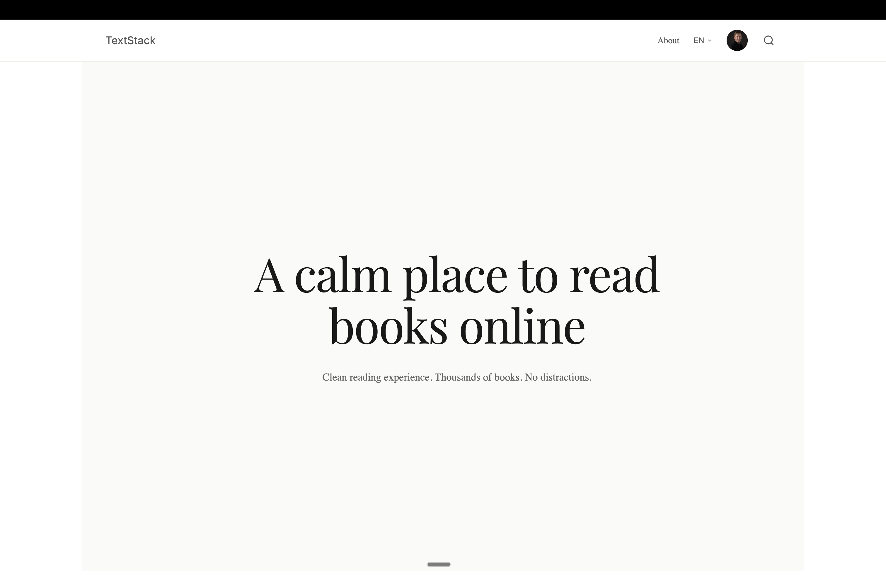

# TextStack

<p align="center">
  
</p>

Free book library w/ Kindle-like reader. Upload EPUB/PDF/FB2 → parse → SEO pages + offline-first sync.

**Live**: [textstack.app](https://textstack.app/)

## Quick Start

```bash
cp .env.example .env    # Edit with real values
docker compose up --build
```

| Service | URL |
|---------|-----|
| API | http://localhost:8080 |
| Admin | http://localhost:81 |
| Aspire | http://localhost:18888 |

## Stack

- **Backend**: ASP.NET Core (API + Worker) + PostgreSQL + EF Core
- **Frontend**: React (Vite)
- **Search**: PostgreSQL FTS (tsvector + GIN)
- **Observability**: .NET Aspire Dashboard

## Structure

```
backend/src/
  Api/            # Minimal API, auth, endpoints
  Worker/         # Book ingestion pipeline
  Domain/         # Entities, value objects
  Infrastructure/ # DbContext, migrations, storage
  Application/    # Use cases, services
  Search/         # FTS queries
  Extraction/     # EPUB/PDF/FB2 parsing
  Contracts/      # DTOs

apps/
  web/            # Public site (React)
  admin/          # Admin panel (React)
```

## Commands

```bash
make up             # Start services
make down           # Stop services
make deploy         # Pull + build + restart + SSG
make rebuild-ssg    # Regenerate SEO pages
make backup         # Backup database
make logs           # Tail logs
```

## Docs

See [docs/](docs/) for architecture, ADRs, deployment guides.
