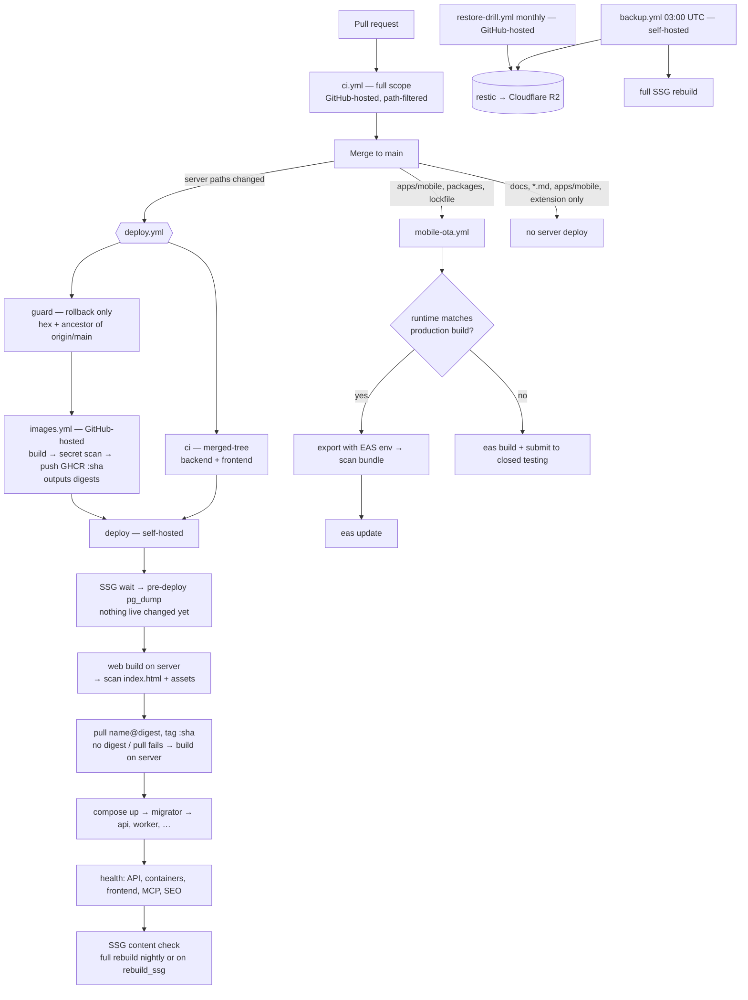

# Delivery pipeline

How a commit reaches production, what it depends on, and what keeps a secret out of it.
Decision record: [ADR-020](adr/ADR-020-build-once-deploy-by-digest.md). Source review: 2026-10-06,
after #742. Verified against `.github/workflows/` on 2026-10-06.

## Goal

**Ship faster, security first, zero secret leaks.** In that order of tie-break: a change that makes
delivery faster but lets a secret reach an image, a bundle or a log does not ship.

- Merge → live in **~8–9 min** for a backend or web change once the slim Dockerfiles land
  (max(CI ≈ 6, images ≈ 5) + deploy ≈ 2). Mobile, extension and docs merges cost the server **0 min**.
- Every artifact a user or the public can download — GHCR images, `apps/web/dist`, the OTA bundle —
  is scanned for secrets before it ships. Secrets exist only at runtime: the server's `.env`, GitHub
  secrets, EAS secrets.

## Flow

`deploy` needs `ci` (and `guard` on a rollback); `images` is allowed to fail (the server builds
instead). The pre-deploy dump is a step inside `deploy`, after the SSG wait and before the web build: a
failed dump ships nothing, and the dump is minutes (web build + scan) before the migrator — see
"Known limits" for why it is not parallel.

## Images

Compressed size (what CI pushes and the server pulls), after #748:

| Image | Base | Size | Notes |
|---|---|---|---|
| api | `aspnet:10.0-alpine` | ~93 MB | single-RID publish (`linux-musl-<arch>`); keeps `git` for Standard Ebooks sync |
| worker | `aspnet:10.0-alpine` | ~110 MB | no Node/browser; ICU on (`HtmlCleaner` normalises), PDFium + Skia musl natives, `font-dejavu` |
| admin | `nginx-unprivileged:stable-alpine` | ~26 MB | static `dist` on :81, SPA fallback |
| ssg-worker | `node:<.nvmrc>-alpine` | ~417 MB | apk Chromium; `pnpm deploy --prod` (pg, puppeteer, `@sentry/node`). Sentry added +6.9 MB compressed, +61 MB on disk (2026-10-07) |
| migrator | `dotnet/sdk:10.0` | ~1.35 GB | full SDK + source; next step: EF migrations bundle (~100 MB) |
| mcp-server | `aspnet:10.0-alpine` | ~53 MB | Sentry added +0.35 MB |

## External dependencies

| dependency | used for | if it is down | fallback |
|---|---|---|---|
| GitHub repo + Actions (hosted runners) | CI, images build, OTA, restore drill, health check | No CI, no deploy, no images | Break-glass by hand on the server (`git pull` + `compose up --build`). Not yet a runbook in `docs/03-ops`. |
| GitHub self-hosted runner service | deploy, pre-deploy + nightly backup, SSG rebuild | No deploy, no nightly backup (site stays up) | Run the same steps by SSH; backups also in R2 |
| GHCR | published images | Pull fails | Deploy falls back to a server build |
| Docker Hub | `node`, `debian` (scanner), `alpine`, `pgvector`, `ollama`, `restic` | Image builds and scans fail; nightly R2 backup fails (restic) if not cached; prod keeps running on cached images | Images cached on the server. If it hurts: mirror bases to GHCR or use `mirror.gcr.io` / `public.ecr.aws/docker/library` |
| MCR (mcr.microsoft.com) | .NET SDK/runtime, Aspire dashboard | .NET image builds fail | gha layer cache; server cache |
| npm registry (+ corepack pnpm download) | all JS installs, CI and the server web build | CI, images and the server web build fail | none (cache in CI only) |
| NuGet.org | .NET restore | CI and image builds fail | gha layer cache covers unchanged restores |
| Alpine / Debian apt mirrors | `apk add`, `apt-get install` in Dockerfiles | Image build fails on cache miss | Retry loop (Worker); gha cache. The secret scan needs no mirror. |
| storage.googleapis.com (Chrome for Testing) | Puppeteer browser download (server `pnpm install` only; images skip it — ssg-worker uses apk Chromium, the Worker has no browser since #748) | Builds fail on cache miss (blocked a deploy 2026-08-20) | Backoff loop |
| registry.ollama.ai | `ollama pull` on each deploy | Warning only | Model already on disk |
| Cloudflare DNS + SSL + Tunnel | all public traffic to the home server | **Site down** | None quick. Keep a way to repoint DNS; the tunnel is the only ingress |
| Cloudflare R2 | off-site restic backups | Nightly off-site step fails (email); local backups still made | Local copies on the server (2 newest) |
| Home server, ISP, power | everything at runtime | **Site down** | R2 backup + restore drill (RTO measured monthly); no warm standby |
| Expo EAS (build, update, submit, env) | OTA updates, Android builds, OTA bundle env | No mobile releases; installed apps keep working | Local `eas build --local` |
| Google Play | Android distribution | No new releases | none |
| Apple App Store | iOS (later) | — | — |
| OpenAI | translate, explain, tutor, Worker book metadata | Those features fail; reading works | Ollama for some paths only; explain/translate file caches |
| Ollama (local) | vocab distractors, hints | Words save without distractors | Random-word fallback |
| Edge TTS (speech.platform.bing.com) | text-to-speech | TTS fails for uncached text | Disk + IndexedDB cache |
| Google OAuth / Apple Sign-In | sign-in | Those sign-ins fail | Email/password; guest reading |
| Resend | password reset, admin alerts | No emails | none |
| Sentry | errors (api, worker, mcp-server, ssg-worker; mobile in its own project) + 20 % of API request traces | Blind to errors; app unaffected (no DSN = SDK never loaded) | Container logs (`docker compose logs`, 5 × 10 MB per service) |
| Anthropic (Claude CLI on the server) | auto-publish SEO, SEO backfill, quality poller | Jobs fail/queue | Retry next poll |
| IndexNow (Bing/Yandex) | crawl pings | Slower indexing | Sitemaps |
| Open Library | metadata/cover lookups | Missing enrichment | none needed |
| GitHub (Standard Ebooks repos) | `git clone` in the admin sync | Sync fails | Manual upload |
| Google Fonts, Google Tag Manager | web fonts, analytics | Fallback fonts, no analytics | none needed |

Single points of failure that matter: **the home server + Cloudflare tunnel** (runtime) and
**GitHub** (delivery). Everything else degrades one feature or blocks one build.

## Observability

What reaches the owner, and what deliberately does not exist.

| signal | where it goes | covers |
|---|---|---|
| Errors | Sentry, one project (`dotnet-aspnetcore`), filtered by the `service` tag: `api`, `worker`, `mcp-server`, `ssg-worker` | api, worker, mcp-server: anything logged at Error (the API's unhandled exceptions arrive through `ExceptionMiddleware`'s `LogError`). mcp-server logs one when a tool's mapping breaks — before 2026-10-07 that branch reported nothing. ssg-worker: a failed rebuild job, each route that still fails after prerender's retries (capped at 20 per job, grouped into one issue), a poll-loop failure (once until the loop recovers), a crash. |
| Request traces | Sentry, API only: 20 % of `http.server` (`SentryBootstrap` default; compose does not forward `Sentry__TracesSampleRate`), every AI agent run, never `/health` | Latency and the AI routing spans. No other service sends transactions. |
| Mobile crashes | Sentry project `textstack-mobile` | The reader app (its own scrubber, `apps/mobile/src/lib/sentryScrub.ts`) |
| Uptime | `health-check.yml` every 5 min (GitHub email); UptimeRobot (see `docs/03-ops/uptime-monitoring.md`) | Both hosts, API body, SSG freshness |
| Metrics | **none in production** | — |

**OpenTelemetry is off in production.** Traces, metrics and logs are exported over OTLP only when
`OTEL_EXPORTER_OTLP_ENDPOINT` is set; without it nothing is registered (`TelemetryExtensions`). Until
2026-10-07 production pointed it at `aspire-dashboard`, a container behind the `observability` profile
that the deploy never starts: every batch was built, failed to resolve and was dropped, with no log line
(the exporter reports through an EventSource). Aspire is still the local tool — `docker compose
--profile observability up -d aspire-dashboard`, `OTEL_EXPORTER_OTLP_ENDPOINT=http://aspire-dashboard:18889`
in `.env`, UI on `127.0.0.1:18888` — and keeps telemetry in memory only.

**SDK defaults overridden for every .NET host** (`SentryBootstrap.Apply`):

| default | ours | why |
|---|---|---|
| DiagnosticSource integration on | **off** | It records EF Core / Npgsql `db.*` spans whose description is the full SQL. API traces lose their database child spans; the `http.server` transaction, outgoing-HTTP and AI spans stay. `ScrubTransaction` also blanks any `db.*` description. |
| `CaptureFailedRequests` true | **false** | A failed outgoing call (OpenAI, Edge TTS, Open Library, the bridge's API calls) is reported by the code that made it; the SDK's extra event would double it and carry the URL. |
| `TracePropagationTargets` `.*` | **empty** | No `sentry-trace`/`baggage` headers to anyone: every downstream is a third party, and no service of ours continues another's trace. |
| HTTP handler on every `HttpClient` | **off on mcp-server** (`DisableSentryHttpMessageHandler`) | That host sends no traces; the handler would only add headers and URL breadcrumbs. Kept on API/Worker for the outgoing-HTTP spans in API traces. |

**If metrics are wanted later:** a hosted OTLP backend (e.g. Grafana Cloud's free tier) is the
endpoint plus an auth header — no code change. It is the owner's call because of cost and privacy:
OTLP traces carry full SQL text (`SetDbStatementForText`) and the client IP (`http.client_ip`), and
none of it passes the Sentry scrubber. Strip both before pointing production at a third party.

**Privacy (the policy's promise).** Every service scrubs before sending, by allowlist: tags and
extras not blessed are dropped or redacted; no user, no cookies, no request bodies, no query strings;
free text loses credentials (bearer, every issued prefix — `tsk_`, `tso_`, `tsr_`, `tsc_` — JWTs) and
query strings, and is truncated.
The .NET hosts share `TextStack.Observability` (`SentryScrubber`), which also redacts emails, phones and
the `/mcp/k/<key>` segment; mcp-server additionally drops exception messages (tool arguments are the
reader's text) and keeps Information lines out of breadcrumbs. The ssg-worker ports the URL and
credential rules (`apps/web/scripts/ssgSentry.mjs`; it handles only the public catalog, plus URL
userinfo for `DATABASE_URL`), sends no breadcrumbs (prerender's console quotes page HTML) and reports a
failed route by path and the first line of its error only. A local `Development`
environment reports nothing on any service.

## Security controls

| control | where | what it stops |
|---|---|---|
| Secrets only at runtime | server `.env`, GitHub secrets, EAS secrets | Nothing secret is a build input. Images are public. |
| Image secret scan gates the push | `images.yml` → `scripts/scan-image-secrets.sh` | Every `.env.example` name **and every `${VAR}` in the compose files** is a canary; a canary, token shape, private key or secret-named file in `Config.Env`, history or **any single layer** (incl. files deleted later) fails the job before anything is pushed. |
| Web bundle scan | `deploy.yml` "Secret scan web dist" | Same patterns over vite's output (`dist/index.html` + `dist/assets/`; the SSG trees are Puppeteer's and are rewritten concurrently), plus the server's real values of `*SECRET`, `*PASSWORD`, `*TOKEN`, `*API_KEY`. Stray `apps/web/.env*` files are moved aside before vite runs. |
| OTA bundle scan | `mobile-ota.yml` | Same patterns over an `expo export` made with the EAS production environment, plus `EXPO_TOKEN`'s value; gates `eas update`. |
| `.dockerignore` | repo root | `.env*`, keys, service accounts, `appsettings.*.json`, `bin/`, `obj/` never enter a build context. |
| Actions pinned by SHA | every `uses:` in `.github/workflows/` | A moved tag cannot change code that runs next to `EXPO_TOKEN`, a write token or the self-hosted runner. Dependabot bumps the SHA and the `# vX.Y` comment. |
| Images pinned by digest | `docker-compose.yml`, `backup.yml` (restic), scanner, Makefile; every Dockerfile `FROM` (#748; `scripts/check-node-version.mjs` requires the node FROM to be a literal pinned `.nvmrc` version) | A re-pushed tag cannot swap the DB, the backup tool (sees R2 keys and `.env`) or the scanner. Dependabot (`docker`, `docker-compose`) bumps them weekly. |
| Deploy pulls by digest | `images` output → `deploy` | A `:sha` tag re-pushed between build and pull is ignored; the server runs the bytes that passed the scan. |
| Rollback input guarded | `deploy.yml` `guard` | `rollback_commit` must be 7–40 hex, resolve in a full clone, and be an ancestor of `origin/main`; passed via `env:`, never interpolated into `run:`. |
| Least-privilege tokens | top-level `permissions:` in every workflow | Read-only (or none) by default; only `images` (packages: write), `deps-refresh` (contents + PRs) and `publish-mcp-nuget` (id-token) widen, per job. |
| Fork-PR approval | repo setting `all_external_contributors` | No outside PR runs any workflow without the owner's click. |
| Self-hosted runner never runs `pull_request` | `ci.yml` is all `ubuntu-latest`; no `pull_request_target` anywhere | PR code never touches the prod box. Keep it that way. |
| Push protection + secret scanning | repo settings | First line: a secret in a commit is refused at `git push`, before any image exists. |

## Known limits

- **The web dist scan is after the fact.** Vite builds into the served `dist/`, so a hit stops the
  deploy (no new containers) but the bundle is already live, against the old API containers. A
  build-to-temp-and-swap would have to re-do the SSG snapshot/restore choreography (four incidents'
  worth of guards), so it is not a cheap reorder. Fix: build `dist` on GitHub, scan it there, ship it
  as an artifact (review P2-2).
- **The OTA scan checks an equivalent bundle**, not the uploaded bytes (`eas update` bundles again
  from the same commit and environment). EAS store builds bundle on Expo's servers and are not scanned.
- **Pins Dependabot cannot see:** the scanner (`debian:13-slim`) in the scan script, restic in
  `backup.yml`, alpine in the Makefile, `node:${NODE_VERSION}-alpine` (ARG form). Bump by hand:
  `docker buildx imagetools inspect <image:tag>`.
- **Rollback to an already-published SHA** takes its digest from the registry at that moment (no
  push happened in this run to report one).
- **The pre-deploy dump stays on the critical path (~2.5 min), on purpose.** Running it in a parallel
  job at the start of the run would put CI, images and the up-to-40-min SSG wait — up to an hour of
  writes — between the dump and a bad migration, all lost on restore. It runs after the SSG wait and
  before the web build, so a failed dump changes nothing live; the gap to the migrator is the web
  build + scan, a few minutes. Correctness of the rollback point beats 2.5 minutes.
- **The scanner a deploy runs is the workflow commit's** (`git show $GITHUB_SHA:scripts/…` into
  `$RUNNER_TEMP`), so a rollback to a commit older than the script still scans and finishes.
- **One non-ephemeral self-hosted runner, repo-level.** A `workflow_dispatch` from another branch
  runs that branch's workflow on it (write access required). Limiting the runner to `deploy.yml` /
  `backup.yml` on `main` needs an org runner group.
- **The deploy gate does not check the schema.** It waits on `/health` (liveness). The migrator
  exiting non-zero already stops the deploy (`api` needs `service_completed_successfully`); any other
  schema behind the build is caught by `health-check.yml` "Schema matches the build" within 5 min, not
  by the deploy ([ADR-021](adr/ADR-021-migrations-owned-by-the-migrator.md)).
- **The deploy's SSG wait and the worker's job deadline go together.** deploy.yml waits up to 40 min
  for a `Running` rebuild started in the last 60 min. ssg-worker stops a rebuild that has rendered
  nothing for 5 min (`SSG_JOB_STALL_MS`) and marks it `Failed`, so a hung job ends within ~5 min of
  its last rendered route. Before 2026-10-07 it stayed `Running`, and every deploy in the next hour
  waited the full 40 min, then deployed beside a live job. A rebuild that keeps rendering may run
  longer than the wait, up to max(60 min, 2 s per route) (`SSG_JOB_DEADLINE_MS`); the deploy then goes
  ahead after 40 min, as it always has, and the worker's survival floor refuses a build the web
  build wiped.
- **Free disk space** in `images.yml` stays until the slim Dockerfiles land and a run shows the room.
- **GHCR packages are public**: they expose OS patch levels and the deploy cadence. Accepted.
- **Scan blind spots:** nested archives (zip, nupkg, jar, tgz) are not unpacked; token shapes outside
  the regex (Resend `re_`, `GOCSPX-`, `gho_`/`ghs_`, `npm_`, R2 hex keys, the JWT secret) are caught
  only by value in the dist scan, not in images. Push protection is the first line.

## Where to change what

| to change | edit |
|---|---|
| Which pushes deploy | `deploy.yml` `paths-ignore` — never add `packages/**`, the lockfile or `pnpm-workspace.yaml` |
| The list of published images | `SERVICES` in `images.yml` **and** the service loops in `deploy.yml` "Deploy containers" |
| Secret patterns, allowlist, scanner image | `scripts/scan-image-secrets.sh` (`CONTENT`, `PEM`, `NAMES`, `ALLOW`, `SCANNER`) |
| Which server values the web scan treats as secret | `deploy.yml` "Secret scan web dist" (the awk name filter) |
| An action version | Let Dependabot do it; by hand: `gh api repos/<owner>/<repo>/commits/<tag> --jq .sha`, keep the `# vX.Y` comment |
| A pulled image version | `docker-compose.yml` `image: name:tag@sha256:…` (Dependabot weekly); restic/scanner/Makefile by hand |
| Pre-deploy backup | `deploy.yml` step "Pre-deploy backup" (after the SSG wait, before the web build); nightly + R2: `backup.yml`; drill: `restore-drill.yml`; ops: [`backup.md`](../03-ops/backup.md) |
| Rollback | Actions → Deploy → Run workflow → `rollback_commit` = a SHA on main |
| Full SSG rebuild on deploy | Run workflow with `rebuild_ssg`, or `make rebuild-ssg` |
| Workflow permissions | top-level `permissions:` stays read/none; widen per job |
| Database schema / rollback | Only the `migrator` service migrates ([ADR-021](adr/ADR-021-migrations-owned-by-the-migrator.md)); rollback `docker compose run --rm -e MIGRATE_TARGET=<name> migrator` with the **current** image, **before** `rollback_commit`. Behind-schema alarm: `health-check.yml` step "Schema matches the build" |
| What Sentry may receive | .NET: `backend/src/Observability/TextStack.Observability/SentryScrubber.cs` (+ `McpHosts.ConfigureSentry`); ssg-worker: `apps/web/scripts/ssgSentry.mjs`; mobile: `apps/mobile/src/lib/sentryScrub.ts`. Change all three together, and the privacy policy if the promise changes |
| OpenTelemetry export | `OTEL_EXPORTER_OTLP_ENDPOINT` in the server `.env` (unset = off) |
