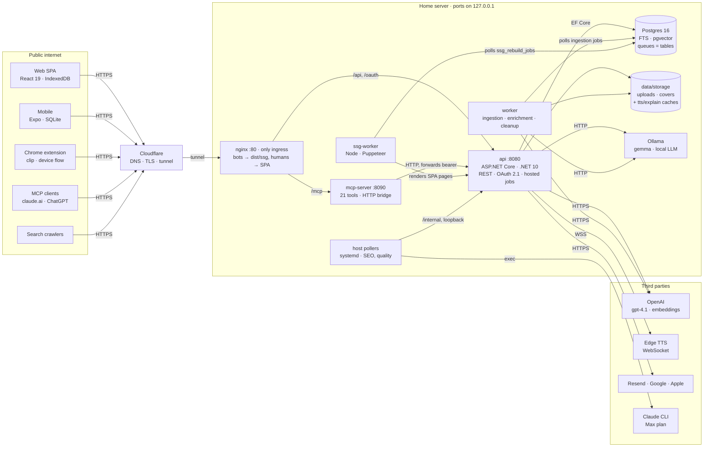
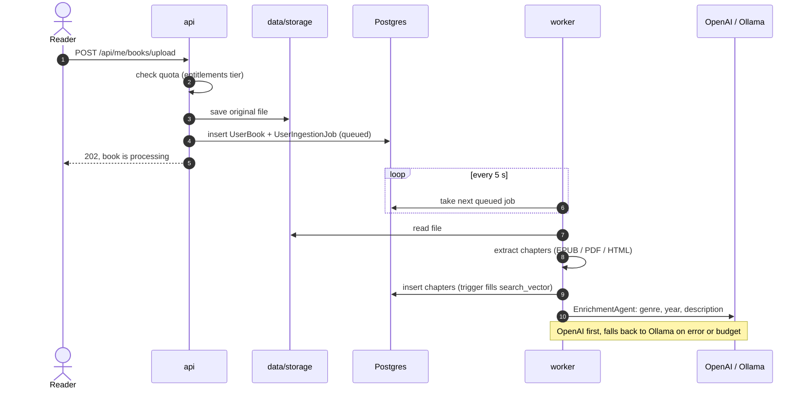
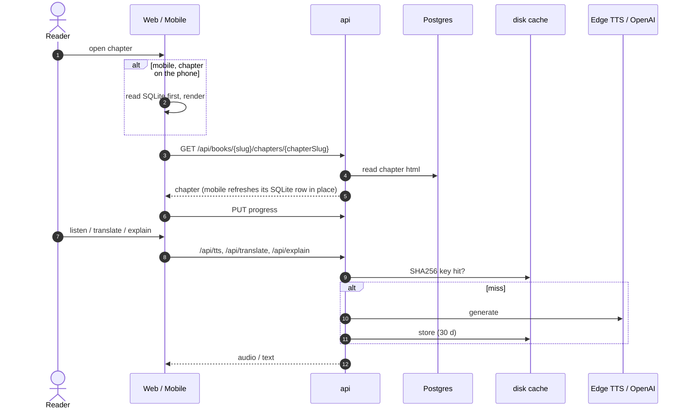
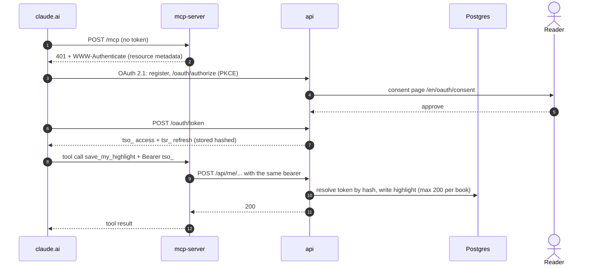
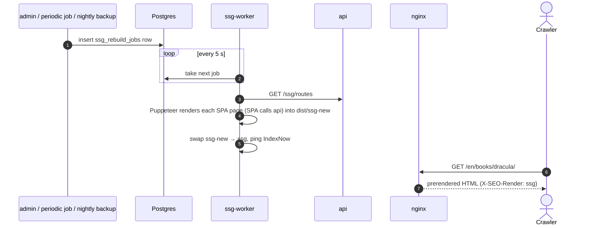
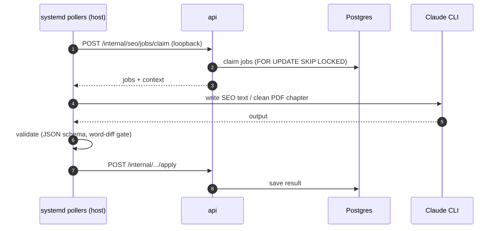

# How a book moves through TextStack

The runtime view. [README.md](README.md) lists the parts; this file shows how requests move
between them, one diagram per scenario (C4 "dynamic" view). Verified against code on 2026-10-06.

## The map

One API, one worker, one Postgres, three clients and an MCP bridge. Queues are Postgres tables
that a worker polls; there is no broker. Everything runs on one home server behind a Cloudflare
tunnel, and all ports bind to `127.0.0.1` — nginx is the only way in.

Not drawn: admin SPA (`textstack.dev`), migrator, Sentry, IndexNow, Aspire dashboard.

## 1. Upload a book

- The upload request does no parsing. It saves bytes and a row, then returns — slow work is in the worker.
- The queue is a table (`user_ingestion_jobs`; the admin catalog uses `ingestion_jobs`). Same worker, `IngestionWorker`.
- Search needs no indexer: a DB trigger keeps `search_vector` current.

## 2. Read a chapter

- Mobile is offline-first: it renders from SQLite and never waits for the network.
- Web keeps chapters in IndexedDB only for books you downloaded.
- Every paid or slow call (TTS, translate, explain) is behind a disk cache, so a repeat costs nothing.

## 3. Claude via MCP

- The bridge holds no state and no secrets. It only forwards the bearer; the API checks it.
- Tokens are stored as hashes, so a DB leak does not leak working tokens.
- Assistant writes have their own ceiling (200 highlights per book) and a per-user rate limit.

## 4. Bots and SEO

- Bots get static HTML, humans get the SPA. So a browser check cannot see what Google sees — use `curl -I`.
- The swap is atomic: the site never serves a half-built folder.

## 5. Background AI

- The pollers run on the host, not in Docker, because the Claude CLI uses the owner's Max plan.
- `/internal` is reachable only on loopback; nginx blocks `/api/internal` from the internet.
- Other background work runs as hosted services in api and worker: metadata backfill, guest
  cleanup, vocabulary cap promotion, drift detection, continuous evals. See [README.md](README.md#background-work).

## Trust boundaries

| Who | How they prove identity | Where it is checked |
|-----|-------------------------|---------------------|
| Web / mobile users | JWT access (60 min) + rotating refresh. Google, Apple, email or guest | Endpoints call `GetUserId` |
| Claude, ChatGPT | OAuth 2.1 + PKCE, hashed `tso_`/`tsr_` tokens, scope `library` | API (`McpKeyAuth`); the bridge only forwards |
| Extension, stdio MCP | Device-flow JWT or `tsk_` connect key | API (`McpKeyAuth`) |
| Admin | Separate `admin_access_token` cookie | `AdminAuthMiddleware` on `/admin/*` |
| Host pollers | Loopback only | nginx blocks `/api/internal` |
