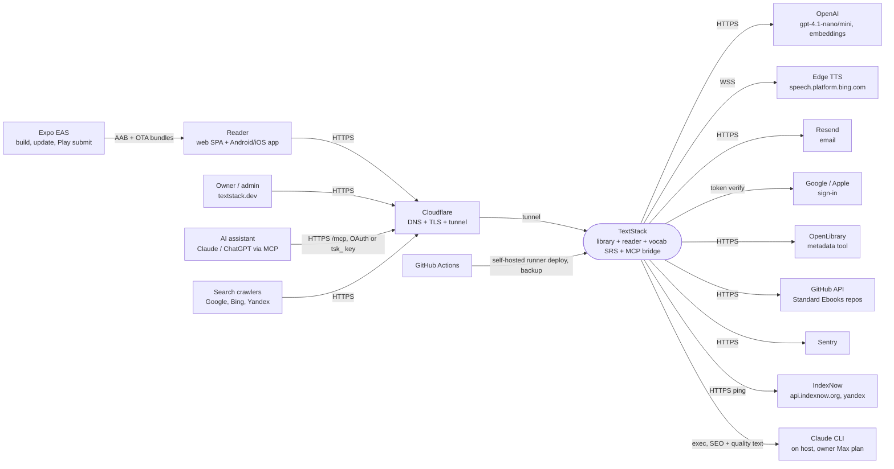
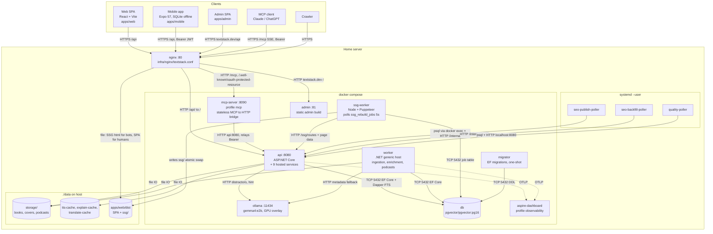
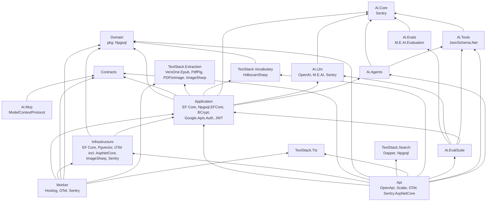
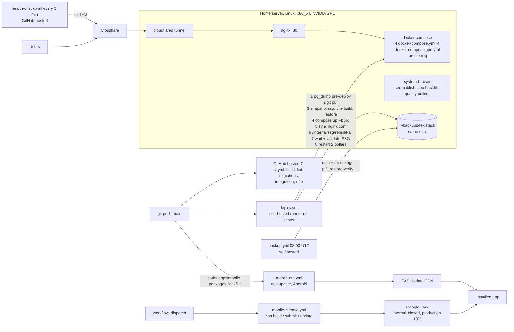
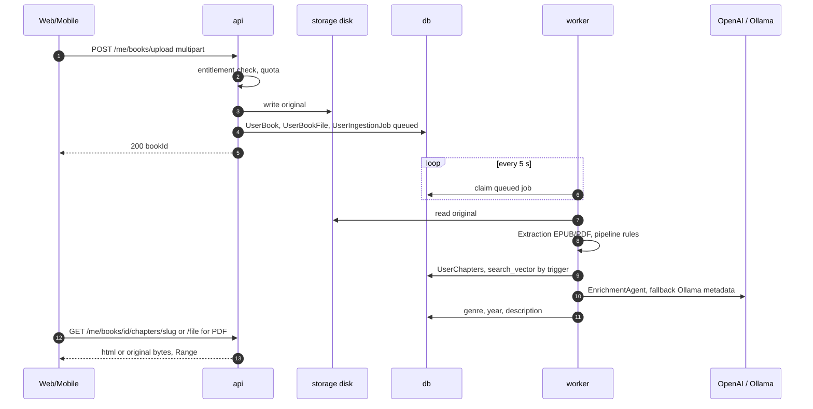
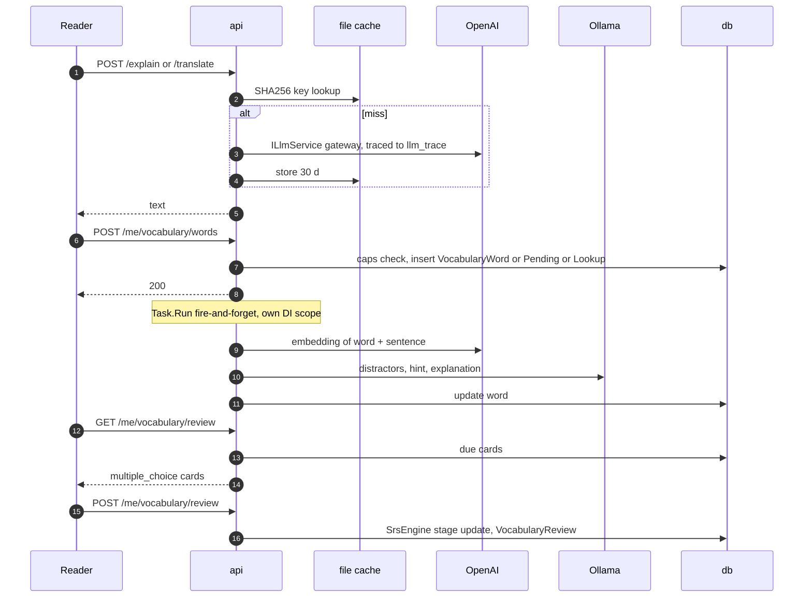
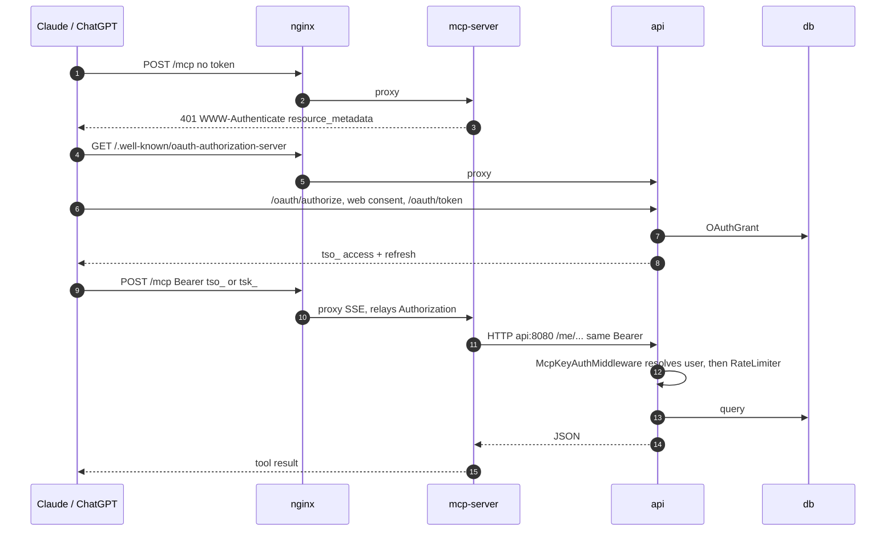
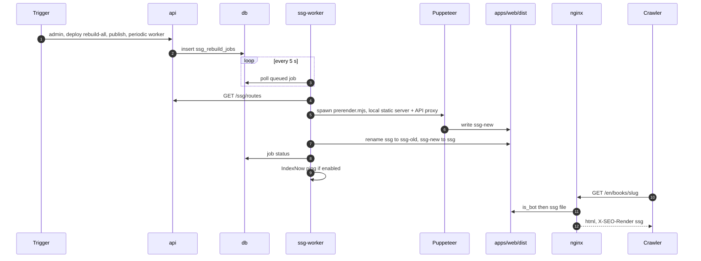

# 01 — System map (as built, 2026-10-04)

Everything below was read from code and config, not from docs. Main sources:
`textstack.sln`, `backend/src/**/*.csproj`, `backend/src/Api/Program.cs`,
`backend/src/Api/Extensions/ServiceCollectionExtensions.*.cs`, `backend/src/Worker/Program.cs`,
`docker-compose.yml`, `docker-compose.gpu.yml`, `infra/nginx/textstack.conf`,
`.github/workflows/*.yml`, `infra/systemd/*.service`, `infra/scripts/*.sh`, `apps/*`, `packages/*`.

## 1. C4 L1 — System context

Ollama is in-house (a container), so it is in L2, not here.
Outbound hosts in backend code: `grep -rhoE "https://..." backend/src` —
`openlibrary.org`, `api.resend.com`, `speech.platform.bing.com`, `appleid.apple.com`,
`api.github.com` (`Application/TextStack/StandardEbooksSyncService.cs:32`).
IndexNow: `apps/web/scripts/ssg-worker.mjs:289`.

## 2. C4 L2 — Containers

Notes:
- Ports bind `127.0.0.1` only (`docker-compose.yml`); nginx is the only public listener, reached via Cloudflare tunnel.
- `mcp-server` has no DB/OpenAI access; it only calls the API (`backend/src/Ai/TextStack.Ai.Mcp/TextStack.Ai.Mcp.csproj` references only `Contracts`).
- Pollers shell out to the `claude` CLI on the host (`infra/scripts/seo-generate.sh`, `seo-backfill-generate.sh`, `quality-poll.sh`).

## 3. C4 L3 — API components

```mermaid
flowchart TB
    subgraph pipeline["Middleware, Program.cs:142-316"]
        p1["ForwardedHeaders"] --> p2["Cors"] --> p3["ExceptionMiddleware"] --> p4["StaticFiles /storage"] --> p5["/health, /health/ready"] --> p6["SiteContext"] --> p7["LanguageContext"] --> p8["Routing"] --> p9["McpKeyAuth tsk_/tso_"] --> p10["RateLimiter"] --> p11["GuestActivity"] --> p12["AdminAuth on /admin/*"]
    end

    subgraph eps["Endpoint groups, Api/Endpoints"]
        e_pub["Public catalog<br/>Books, Authors, Genres, Search,<br/>Site, Seo, Ssg, Podcast public"]
        e_auth["Identity<br/>Auth, DeviceAuth, OAuth,<br/>McpKeys, McpManifest, Account, Profile"]
        e_me["Reader data<br/>UserData, Highlights, Insights,<br/>ChapterReview, UserBooks, LibraryShelves,<br/>Collections, ReadingTracking"]
        e_lang["Language<br/>Translation, Explain, Tts,<br/>Vocabulary + Lookups/Pending/Clusters, Tutor"]
        e_adm["Admin<br/>Admin, Authors, Genres, SsgRebuild,<br/>AutoPublish, SeoBackfill, Lint, Settings,<br/>Diagnostics, BookQuality, AiQuality"]
        e_int["Internal, docker net only<br/>Internal, InternalSeo"]
    end

    subgraph app["Application, backend/src/Application"]
        a_auth["Auth, AdminAuth, Entitlements"]
        a_books["Books, UserBooks, Library,<br/>Collections, ChapterReview"]
        a_vocab["Vocabulary, ReadingTracking"]
        a_seo["Seo, SsgRebuild, TextStack import,<br/>Reprocessing, Admin"]
        a_ai["LLM, Ai, Agents, Tools"]
    end

    subgraph libs["Libraries"]
        l_srch["TextStack.Search<br/>Postgres FTS, Dapper"]
        l_voc["TextStack.Vocabulary<br/>SrsEngine, DistractorGenerator"]
        l_tts["TextStack.Tts<br/>EdgeTtsService"]
        l_llm["TextStack.Ai.Llm<br/>ModelGateway, TracingDecorator,<br/>OpenAi/Ollama clients"]
        l_inf["Infrastructure<br/>AppDbContext, LocalFileStorage,<br/>ResendEmailService"]
    end

    pipeline --> eps
    e_pub --> a_books
    e_pub --> l_srch
    e_auth --> a_auth
    e_me --> a_books
    e_me --> a_vocab
    e_lang --> a_vocab
    e_lang --> l_voc
    e_lang --> l_tts
    e_lang --> l_llm
    e_adm --> a_seo
    e_adm --> a_ai
    e_int --> a_seo
    app --> l_inf
    a_ai --> l_llm
```

Endpoint registration: `backend/src/Api/Program.cs:318-359` (42 `Map*Endpoints` calls).
CLI verbs also live in `Program.cs:362-640`: `import-textstack`, `optimize-images`, `create-admin`,
`backfill-vocabulary-embeddings`, `cluster-vocabulary`.

### Hosted services: which process runs what

| Process | Hosted service | File | Notes |
|---|---|---|---|
| api | `EdgeTtsService` (startup cache cleanup) | `backend/src/Tts/TextStack.Tts/EdgeTtsService.cs`, reg. `Api/Extensions/ServiceCollectionExtensions.Content.cs:75` | |
| api | `SsgPeriodicRebuildWorker` | `backend/src/Api/Services/SsgPeriodicRebuildWorker.cs` | enqueues SSG jobs |
| api | `AutoRetireSweeperWorker` | `backend/src/Api/Services/AutoRetireSweeperWorker.cs` | vocab F4 |
| api | `DailyCapReconcilerWorker` | `backend/src/Api/Services/DailyCapReconcilerWorker.cs` | pending → SRS |
| api | `WordFrequencyLoaderWorker` | `backend/src/Api/Services/WordFrequencyLoaderWorker.cs` | one-shot seed |
| api | `ClusterCandidateBuilderWorker` | `backend/src/Api/Services/ClusterCandidateBuilderWorker.cs` | 24 h |
| api | `ConceptClusteringWorker` | `backend/src/Api/Services/ConceptClusteringWorker.cs` | weekly |
| api | `ContinuousEvalWorker` | `backend/src/Api/Services/ContinuousEvalWorker.cs` | off by default |
| api | `DriftDetectionWorker` | `backend/src/Api/Services/DriftDetectionWorker.cs` | off by default |
| worker | `AiProviderReadinessCheck` | `backend/src/Worker/Services/AiProviderReadinessCheck.cs` | must be first |
| worker | `IngestionWorker` | `backend/src/Worker/Services/IngestionWorker.cs` | polls 5 s, admin + user uploads |
| worker | `MetadataEnrichmentWorker` | `backend/src/Worker/Services/MetadataEnrichmentWorker.cs` | sweep Pending/stale |
| worker | `PodcastWorker` | `backend/src/Worker/Services/PodcastWorker.cs` | LLM + TTS + ffmpeg |
| worker | `GuestCleanupWorker` | `backend/src/Worker/Services/GuestCleanupWorker.cs` | 2 h / 30 d |
| worker | `AdminRefreshTokenCleanupWorker` | `backend/src/Worker/Services/AdminRefreshTokenCleanupWorker.cs` | daily |
| worker | `HeartbeatWorker` | `backend/src/Worker/Services/HeartbeatWorker.cs` | docker healthcheck file |
| worker | `MetadataBackfillWorker` | `backend/src/Worker/Services/MetadataBackfillWorker.cs` | one-shot heal |
| worker | `TextStackWatcher` | `backend/src/Worker/Services/TextStackWatcher.cs` | only if `TextStack:EnableWatcher` |

Not a hosted service but background work in the API: vocabulary enrichment is a
`Task.Run` fire-and-forget inside the request handler (`Api/Endpoints/VocabularyEndpoints.cs:292`).

## 4. Backend project dependency graph

Layering findings (all from csproj or code):

| # | Finding | Evidence |
|---|---|---|
| L1 | Domain is not framework-free: depends on `Npgsql` for `NpgsqlTsVector` | `backend/src/Domain/Domain.csproj`, `backend/src/Domain/Entities/Chapter.cs:1,31` |
| L2 | Application references the EF Npgsql provider and a concrete LLM implementation (`Ai.Llm`), and wires `OpenAiLlmClient`/`OllamaLlmClient` itself — composition-root work in the Application layer | `backend/src/Application/Application.csproj`, `backend/src/Application/DependencyInjection.cs:158-176` |
| L3 | AI library `Ai.EvalSuite` depends upward on `Application`; `Api` depends on `Ai.EvalSuite` — an eval harness ships in the production API | `backend/src/Ai/TextStack.Ai.EvalSuite/TextStack.Ai.EvalSuite.csproj`, `backend/src/Api/Api.csproj` |
| L4 | Infrastructure carries ASP.NET Core instrumentation (`OpenTelemetry.Instrumentation.AspNetCore`) though Worker is not a web host | `backend/src/Infrastructure/Infrastructure.csproj` |
| L5 | Worker builds its own DbContext wiring (not the shared `AddTextStackPersistence`) with a hard-coded fallback connection string incl. password `changeme` | `backend/src/Worker/Program.cs:25-35` |

Not violations: `Ai.Mcp → Contracts` only (clean bridge); `Search` is standalone (raw SQL).

## 5. Deployment

Evidence: `.github/workflows/deploy.yml:42-456`, `.github/workflows/backup.yml:5,16,27-49`,
`.github/workflows/mobile-ota.yml:47-60`, `.github/workflows/mobile-release.yml:23-130`,
`.github/workflows/health-check.yml:19-44`, `infra/systemd/*.service`.
cloudflared is not in the repo (only described in `docs/03-ops/deployment.md`).

## 6. Key runtime flows

### 6a. Upload → ingestion → read

`Worker/Services/IngestionWorker.cs:12`, `Worker/Services/UserIngestionService.cs`,
`Worker/Services/EnrichmentAgentMetadataGenerator.cs`, `Api/Endpoints/UserBooksEndpoints.cs`.

### 6b. Word tap → explain/translate → save → enrichment → review

`Api/Endpoints/ExplainEndpoints.cs:33,63`, `Api/Endpoints/TranslationEndpoints.cs:15,33`,
`Api/Endpoints/VocabularyEndpoints.cs:255-320`, `Vocabulary/TextStack.Vocabulary/DistractorGenerator.cs`.

### 6c. MCP request

`backend/src/Ai/TextStack.Ai.Mcp/McpHosts.cs:173-179`, `Api/Middleware/McpKeyAuthMiddleware.cs:35-53`,
`Api/Endpoints/OAuthEndpoints.cs`, `infra/nginx/textstack.conf:232-320`.

### 6d. SSG rebuild → crawler

`apps/web/scripts/ssg-worker.mjs:62,99-133,289,370-375`, `apps/web/scripts/prerender.mjs:16,61-160`,
`infra/nginx/textstack.conf:343-385`.

## 7. Data stores

| Store | Location | Contents | Backed up? | Evidence |
|---|---|---|---|---|
| PostgreSQL 16 + pgvector | `./data/postgres-prod` (container `db`) | all entities (64 DbSets), FTS vectors, embeddings, llm_trace, job queues | **Yes**, daily + pre-deploy, keep 5, restore-verified, **same host** | `backup.yml:29,49`, `deploy.yml:46` |
| Book storage | `./data/storage` → `/storage` (api, worker) | originals, covers, podcast mp3 | **Yes**, daily tar, keep 5, same host | `backup.yml:34` |
| TTS cache | `./data/tts-cache` | mp3 by SHA256, 30 d, 1 GB | No (regenerable) | `docker-compose.yml` api volumes |
| Explain cache | `./data/explain-cache` | JSON by SHA256, 30 d | No (regenerable, costs OpenAI) | `ExplainEndpoints.cs:63` |
| Translate cache | `./data/translate-cache` | JSON by key | No (regenerable, costs OpenAI) | `TranslationEndpoints.cs:33` |
| TextStack import source | `./data/textstack` → api | source books for `import-textstack` | No | `docker-compose.yml` api volumes |
| Ollama models | `./data/ollama` | gemma4:e2b weights | No (re-pull) | `docker-compose.yml` ollama |
| SSG output | `apps/web/dist/ssg` | prerendered HTML | No (rebuilt; deploy snapshots it) | `deploy.yml:83-238` |
| PDF cleanup dataset | `data/pdf-cleanup-dataset` | quality-poller training pairs | No | `infra/scripts/quality-poll.sh:23` |
| Secrets | `.env` on server | DB, JWT, OpenAI, Resend, Sentry keys | No | not referenced in `backup.yml` |
| Mobile local | SQLite + `Paths.document/originals` + SecureStore | offline chapters, PDF originals (2 GB LRU), tokens | n/a (device) | `apps/mobile/src/lib/offlineDb.ts`, `originalFileCache.ts` |
| Web local | IndexedDB, localStorage | offline chapters, TTS audio, session queue | n/a | `apps/web/src/context/DownloadContext.tsx` |

## Gaps noticed while mapping

- **Health check never tests the API.** `health-check.yml:24,27` curls `https://textstack.app/health` and `textstack.dev/health`, but nginx has no `/health` location (`grep health infra/nginx/textstack.conf` is empty); on textstack.app it falls to `location /` → `try_files $uri /index.html` (`textstack.conf:385-389`) = SPA shell 200, on textstack.dev to the admin container. A dead API passes. Should be `/api/health`.
- **Backups live on the same disk as the data.** `backup.yml` and `deploy.yml:44` write only to `~/backups/textstack`; no rclone/S3/scp anywhere (`grep -i "rclone\|s3\|rsync" backup.yml Makefile` empty). Disk or host loss = total loss. `.env` not backed up either.
- **Vocabulary enrichment is fire-and-forget in the API.** `VocabularyEndpoints.cs:292` `Task.Run` — lost on every deploy/restart; no retry. Worker already has a claim/sweep pattern (`MetadataEnrichmentWorker`) that could own this.
- **API runs 9 hosted services** (`ServiceCollectionExtensions.HostedServices.cs:18-37` + `Content.cs:75`) while a dedicated Worker exists. Background CPU (clustering, HDBSCAN, evals) shares the 1 GB request process (`docker-compose.yml` api memory limit 1G).
- **Layering:** Domain → Npgsql (`Domain/Entities/Chapter.cs:31`); Application wires concrete OpenAI/Ollama clients (`Application/DependencyInjection.cs:158-176`); `Ai.EvalSuite → Application` and `Api → Ai.EvalSuite` (csproj).
- **Podcast feature is live but undocumented** in CLAUDE.md: `PodcastWorker` (`Worker/Program.cs:729`), `PodcastEndpoints.cs:20-22`, ffmpeg in `backend/Docker/Worker.Dockerfile:39`. Unclear if it fits the product thesis.
- **OTLP goes to a container deploy doesn't start.** api/worker export to `http://aspire-dashboard:18889` (`docker-compose.yml`), but aspire is `profiles: ["observability"]` and deploy runs only `--profile mcp` (`deploy.yml:278`). Either it was started by hand or exports fail silently.
- **quality-poller not restarted on deploy.** `infra/systemd/quality-poller.service` exists; `deploy.yml:455-456` restarts only seo-publish and seo-backfill pollers — it keeps running old script code after a deploy.
- **Host pollers bypass the API for DB access** (`psql` via `docker exec`, e.g. `quality-poll.sh`, `seo-backfill-poll.sh` uses `FOR UPDATE SKIP LOCKED`) — schema changes can break them with no compile-time or CI signal.
- **Worker fallback connection string with a password** `changeme` (`Worker/Program.cs:25-26`) — a missing env silently connects to localhost instead of failing fast (the API throws, `Api/Program.cs` "ConnectionStrings:Default is required").
- **Stale comments:** `Worker/Program.cs` "purge inactive guests every 6h" vs `GuestCleanupWorker.cs:15` `FromHours(2)`; `deploy.yml:363` says ssg-worker mount is `/app/dist` but compose mounts `/repo/apps/web/dist`; compose worker comment still cites `podcast.script` routing.
- **CLAUDE.md drift:** middleware order there puts RateLimiter before ExceptionMiddleware and omits `McpKeyAuthMiddleware` (real order `Program.cs:142-316`); lists `db` as `postgres:16` (real: `pgvector/pgvector:pg16`); omits `translate-cache` and the `quality-poller` unit.
- **Leftover data dirs** `data/dictionary-cache` (dictionary removed 2026-10-03) and `data/eval-meai`, `data/presale-books` exist locally with no compose mount — check prod for the same cruft.
- **Global `statement_timeout=10000`** on the DB server (`docker-compose.yml` db command) applies to migrator and pollers too (pg_dump resets it itself) — a long migration fails at 10 s unless it overrides it.
