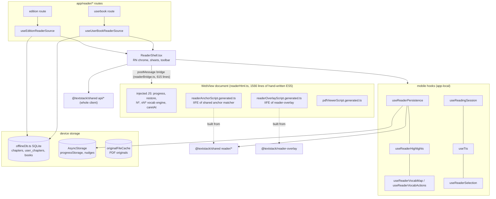

# 05 — Client architecture (web, mobile, admin, shared packages)

Review date 2026-10-04, branch `docs/architecture-review-2026-10`. Read-only review; nothing was changed.
Severity: **P0** = data loss or security, act now · **P1** = real defect or high drift risk · **P2** = debt worth a slice · **P3** = note.

## 1. Component view (C4 L3)

### Web reader (`apps/web`)

```mermaid
flowchart TB
  subgraph Page["ReaderPage.tsx (860 lines)"]
    RP[ReaderPage]
  end
  subgraph WebHooks["web hooks (app-local)"]
    RC[useReaderChapter] --- RSS[useReaderScrollSync] --- RPR[useReaderProgress / useReadingProgress / useRestoreProgress]
    HL[useHighlights] --- RS[useReadingSession] --- TTS[useTts] --- RV[useReaderVocabulary]
  end
  subgraph WebComp["components/reader"]
    SEC[ReaderSection<br/>sanitizeHtml, 1 chapter at a time]
    RH[ReaderHighlights<br/>toolbar + popups orchestrator, 652 lines]
    OV[ReaderOverlay + Highlight/Vocab/Search/Tts layers]
    PDF[PdfOriginalView / PdfHighlightLayer]
  end
  subgraph WebLib["web lib (app-local)"]
    TA[lib/textAnchor.ts<br/>DOM walk -> Range]
    VHE[lib/vocabHighlightEngine.ts]
    IDB[(lib/offlineDb.ts<br/>IndexedDB)]
    API[api/* (own client, own DTOs)]
  end
  subgraph Shared["packages (source alias)"]
    SR["@textstack/shared reader/*<br/>progressPayload, textPosition, textAnchor match, resume, bookProgress, pdf*"]
    SI["@textstack/shared i18n (base catalog)"]
    SA["@textstack/shared api/* (only library, collections, insights, mcpKeys, oauthGrants)"]
    RO["@textstack/reader-overlay<br/>readerOverlay, textWalker"]
  end
  RP --> WebHooks --> API
  RP --> WebComp
  OV --> RO
  RH --> TA --> SR
  RV --> VHE
  HL --> IDB
  RPR --> SR
  RP --> SA
```

### Mobile reader (`apps/mobile`)



### Shared vs duplicated, in one table

| Concern | Shared (one copy) | Duplicated (two copies) |
|---|---|---|
| Progress maths, payload, resume, book %, text position (ADR-015) | `packages/shared/src/reader/*` | — |
| Anchor matching (context ladder, fuzzy) | `shared/reader/textAnchor.ts` → web direct, mobile via generated IIFE | DOM side differs (see G6) |
| Overlay drawing | `packages/reader-overlay` → web direct, mobile via generated IIFE (CI drift check `ci.yml:256-265`) | — |
| i18n strings | `shared/i18n/en.json` + web overrides merged in `apps/web/src/locales/catalog.ts` | resolved in Oct 2026 |
| **HTTP client + DTOs** | mobile uses `shared/api/*` | **web has its own `apps/web/src/api/*` (~1,800 lines) and own DTOs** (G1) |
| **Vocab highlight engine** | — | web `lib/vocabHighlightEngine.ts` (195) vs mobile `readerHtml.ts:992-1290` `vhl*` ES5 string (G4) |
| **Reading session tracker** | — | web `hooks/useReadingSession.ts` (245) vs mobile `hooks/useReadingSession.ts` (209), different semantics (G3) |
| Highlights hook | — | web `hooks/useHighlights.ts` vs mobile `hooks/useReaderHighlights.ts`, different offline behaviour (G2) |
| Vocab review, TTS, card answer, quick stats, reader settings, guest nudge | — | `useVocabularyReview` 194/182, `useTts` 290/247, `useCardAnswer` 17/17 (one-line diff), `guestNudge` 32/49 |

The two readers have **different document models**: web renders one chapter per page (`ReaderSection`); mobile appends chapters into one WebView document. That is why reader *UI* code cannot be shared and should not try to be. The *logic* under it (session tracking, sync, vocab matching, DTOs) can.

## 2. Gaps

### G1 — Web does not use the shared API client; DTOs are hand-written twice (P1)
- **Evidence**: web imports only `libraryApi, collectionsApi, insightsApi, mcpKeysApi, oauthGrantsApi, authFetch, ApiError, initApi` from shared. Everything else is `apps/web/src/api/{auth,userBooks,vocabulary,userData,readingTracking,...}.ts`, which redeclare DTOs: `VocabWordDto`, `ReviewCardDto`, `SaveWordRequest` in `apps/web/src/api/vocabulary.ts:5-195`; `ReviewCardDto` also in `packages/shared/src/types/api.ts`. The shared file itself admits the two copies (`types/api.ts`, comment on `reviewMode`: "a code change across two DTO copies (this one and `apps/web/src/api/vocabulary.ts`)"). Signatures already drifted: web `getReviewQueue(limit, includeAll, practice)` vs shared `getReviewQueue(limit, practice)`. Progress writes: web `api/auth.ts` `upsertProgress` vs shared `api/readingProgress.ts:30-44`.
- **Impact**: a backend contract change must be made in three places (C# Contracts, shared types, web types), and the compiler checks none of them against the server. Web and mobile can send different shapes to the same endpoint (they already send different `updatedAt` semantics, see G5).
- **Options**: (a) finish the Oct 2026 move — web calls `shared/api/*` (cookie mode already works, `apps/web/src/__tests__/sharedApiCookieMode.test.ts`), delete web copies module by module; (b) generate `types/api.ts` from the OpenAPI doc (Scalar already exposes it) with `openapi-typescript`, keep hand-written fetch wrappers; (c) status quo.
- **Recommendation**: (a) now, one module per PR, vocabulary first (largest, already drifted). Then (b) as a CI check (`generate && git diff --exit-code`) — types only, no generated client.

### G2 — Web highlights created while the server is unreachable are silently lost (P0)
- **Evidence**: `apps/web/src/hooks/useHighlights.ts:125-175` stores a highlight with `syncStatus: 'pending'` when the server call fails ("Continue with local-only"). Nothing replays it: grep finds no reader of `syncStatus === 'pending'`. On next load (`:61-101`) the server list replaces state via `setHighlights(converted)`; pending local rows are kept in IndexedDB but are **not shown and never uploaded**.
- **Impact**: user highlights during a network blip; it shows, then disappears after reload. Mobile behaves differently: it shows a toast "Could not add highlight. Try again." (`apps/mobile/src/hooks/useReaderHighlights.ts:184-186`) — honest, but no offline support either.
- **Options**: (a) replay pending rows after the server fetch (POST each, swap id); (b) on failure, do what mobile does — toast and do not pretend it saved; (c) generic outbox in shared used by both clients.
- **Recommendation**: (b) immediately (smallest, honest), (a) only if offline highlighting is a product goal. Do not build (c) until a second entity needs it.

### G3 — Reading sessions: two trackers, mobile drops every offline session (P1)
- **Evidence**: web `hooks/useReadingSession.ts:105-111` queues to `localStorage` then `sendBeacon`, and `flushPendingSessions` (`:200-245`) retries with 404/400 pruning. Mobile `hooks/useReadingSession.ts:69`: `readingTrackingApi.submitSession(data).catch(() => {})` — no queue. Mobile is the offline-first client.
- Also on web: `flushPendingSessions` does `removeItem` then later `setItem(failed)` (`:213`, `:240`); a session saved in between (another tab, or `endAndSubmit` during the awaits) is overwritten and lost.
- **Impact**: stats, streaks and achievements under-count exactly for mobile users reading offline (plane/commute) — the core persona. Server dedup exists (`ReadingSessionService.cs:9-20`, 23505 fallback), so retries are safe.
- **Options**: (a) move the queue/flush logic into `packages/shared` with a storage adapter (localStorage / AsyncStorage); (b) copy the web queue into mobile.
- **Recommendation**: (a). Pure function + adapter, unit-testable in shared vitest. Fix the remove/set race by re-reading the queue before writing back failures.

### G4 — Vocabulary highlight engine exists twice, once as an ES5 string (P1)
- **Evidence**: web `apps/web/src/lib/vocabHighlightEngine.ts` (`computeVocabMatches`, TS, tested). Mobile `apps/mobile/src/lib/readerHtml.ts:985-1290` (`vhlCompute`, `vhlLegacyMark`, `markVocabWords`, …) — hand-written ES5 inside a template string, plus a legacy path and killswitch.
- **Impact**: word-boundary rules, phrase matching, skip rules (`data-vocab-overlay`) can diverge silently; the mobile copy is not type-checked or linted and is tested only via smoke scripts. The repo already solved this pattern for overlay + anchor (`mobile-bundles.mjs` → `*.generated.ts` + CI drift check).
- **Recommendation**: move `computeVocabMatches` into `packages/reader-overlay`, emit it in the existing mobile IIFE bundle, delete `vhlCompute`/`vhlLegacyMark`. Same for `caretAt` (`readerHtml.ts:429`) vs web `textAnchor.ts:231`.

### G5 — Progress LWW compares a client timestamp with a server timestamp (P1)
- **Evidence**: `backend/src/Api/Endpoints/UserDataEndpoints.cs:141` rejects when `request.UpdatedAt <= existing.UpdatedAt`; `:263` stores `existing.UpdatedAt = DateTimeOffset.UtcNow` (server clock). Mobile stamps send time (`packages/shared/src/api/readingProgress.ts:43`, `new Date()`); web stamps record time (`apps/web/src/hooks/useReadingProgress.ts:62,102`).
- **Impact**: a device whose clock is behind the server by Δ has its own next write rejected if it comes within Δ of the previous one (the reply is 200 with the old row, so the client does not notice). A device ahead always wins. Mobile's send-time stamp also means a position queued offline overrides a newer one from another device once it finally syncs. This is the same class of bug ADR-015 was written to end, one layer lower.
- **Options**: (a) store the client's `UpdatedAt` as given (pure client LWW, both sides same clock); (b) server-only ordering (ignore client time, last arrival wins) plus a monotonic per-row `version`; (c) hybrid: accept if `request.UpdatedAt > existing.ClientUpdatedAt`, separate column.
- **Recommendation**: (c) — add `client_updated_at`, compare like with like; mobile must stamp record time, not send time (one line in `readingProgress.ts`). Owner: backend + shared.

### G6 — Highlight anchors are built over different text spaces (P2, needs device check)
- **Evidence**: web builds and resolves anchors over a chapter-scoped walk that skips `.vocab-inline-translation, [data-vocab-overlay]` (`apps/web/src/lib/textAnchor.ts:13`). Mobile resolves over `document.body.textContent` (`readerHtml.ts:763`) — all appended chapters, no exclusion of inline-translation spans.
- **Impact**: a highlight made on one client may land on a wrong occurrence, or fail, on the other, especially with inline translations on. Shared matcher reduces but does not remove it (the prefix/suffix context differs).
- **Recommendation**: have both sides call one shared `collectText(root, excludeSelector)` from `reader-overlay`; add a cross-client fixture test (same HTML, anchor created by web code, resolved by the mobile IIFE in jsdom).

### G7 — No API versioning for old mobile binaries (P2)
- **Evidence**: no `/v1` prefix, no app-version header. Server only distinguishes `X-Client: mobile` (`AuthEndpoints.cs:331`, `shared/api/auth.ts:25`). OTA is guarded by `runtimeVersion.policy: "fingerprint"` (`apps/mobile/app.json:6`) and legacy-runtime banner (`apps/mobile/src/lib/legacyRuntime.ts`) — this protects JS-vs-native, not client-vs-API.
- **Impact**: a store binary that never receives an OTA (OTA disabled, update failed, old runtime) keeps calling the API forever. Breaking a DTO breaks it with no way to detect or tell the user. Additive changes are safe; the codebase already lives by this ("locator kept for builds that predate this", `readingProgress.ts:33`) but it is a convention, not a check.
- **Options**: (a) send `X-App-Version` + runtime from mobile, log it, add a `minSupportedVersion` in `/api/site/context` → force-update screen; (b) URL versioning (overkill for one team).
- **Recommendation**: (a). Cheap, and gives data to know when a compatibility shim can be deleted.

### G8 — State and fetching: Context + per-hook fetch + an event bus (P2)
- **Evidence**: no react-query/SWR in any `package.json`. Web invalidation is a hand-rolled bus (`apps/web/src/lib/dataEvents.ts`: "every mutator calls `emitDataChange`"); mobile guards double fetches with source-asserting tests (`apps/mobile/src/lib/screenFetchCount.test.ts`: "Each of these was a real double request").
- **Impact**: each hook re-implements loading/error/cancel/refetch; no request dedup, no stale-while-revalidate, no cache across screens. Bugs show up as double requests and stale lists, and are guarded by tests that grep source.
- **Options**: (a) adopt TanStack Query in both clients (works on RN), migrate per hook; (b) keep and accept.
- **Recommendation**: (b) for now — the system works and the team is one person; revisit if a third stale-list bug appears. Do **not** add a store (Redux/Zustand); the Context rule is fine.

### G9 — SSG/SPA split: correctness OK, three edges (P2)
- **Evidence**: `infra/nginx/textstack.conf:17-62` UA map → `$ssg_file`; `@spa` returns a hard **404 to bots when no SSG file exists** (`:372-381`).
- **Impact**: (1) a newly published book is a 404 to Googlebot until its SSG job runs (auto-publish enqueues it, but a failed/slow rebuild = 404 crawl, and memory notes a deploy race that wipes SSG). (2) Same URL returns different bodies by UA with no `Vary: User-Agent`; safe today because Cloudflare does not cache HTML by default — a future "cache everything" rule would mix them. (3) AI fetchers without "bot" in the UA (`ChatGPT-User`, `Perplexity-User`) get the empty SPA shell. Content parity is fine: SSG is Puppeteer over the same SPA, so no cloaking risk.
- **Recommendation**: return 503 + `Retry-After` (not 404) to bots for book/author/genre URLs that exist in the DB but have no SSG file yet; add `Vary: User-Agent` on the SSG locations; extend the map with `-user\b` fetchers. Google calls dynamic rendering a workaround, but there is no reason to change it now.

### G10 — JSON-LD is not escaped for `</script>` (P2, security)
- **Evidence**: `apps/web/src/components/JsonLd.tsx:9` `dangerouslySetInnerHTML={{ __html: JSON.stringify(data) }}`. `JSON.stringify` does not escape `<`. Used on `BookDetailPage`, `AuthorDetailPage`, etc. — fed by LLM-generated SEO fields (FAQs, descriptions from `seo-generate.sh`) and EPUB metadata, then baked into SSG HTML.
- **Impact**: a value containing `</script><script>…` executes on a public page. The input is semi-trusted (admin + LLM over book text — prompt injection via a book is plausible; `SeoPromptSanitizer` filters prompt tokens, not HTML).
- **Recommendation**: `JSON.stringify(data).replace(/</g, '\\u003c')`. One line, plus one test.

### G11 — Bundle size (P2)
- **Evidence** (`apps/web/dist`, build of 2026-10-02): entry `index-*.js` 698 KB / **212 KB gzip**; one CSS file 267 KB / 41 KB gzip (all 15.9k lines of `styles/*.css`, reader and PDF included); `charts` 432 KB (lazy, fine); `pdf.worker` 1.3 MB (lazy, fine). 20 pages imported eagerly in `App.tsx:10-29`; entry contains `react-markdown`/`micromark` and `cmdk` (CommandPalette).
- **Impact**: first load on mobile web/SEO landing pages (the pages bots and new users hit) pays for markdown + command palette + reader CSS.
- **Recommendation**: lazy-load `CommandPalette` and `BookInsightsSection`'s markdown; split `reader.css`/`pdfOriginal.css` into the lazy reader chunk (import from `ReaderPage`). Add a size budget check in CI (`size-limit` or a 10-line script on `dist/assets`).

### G12 — Test coverage of the clients (P2)
- **Evidence**: web 117 unit test files + CI (`ci.yml:236`); shared 38 files, tested + typechecked in CI (`ci.yml:244-251`). Mobile: 56 test files, **all in `src/lib`** (`apps/mobile/vitest.config.*`: `include: ['src/lib/**/*.test.ts']`); ~24.5k lines of hooks/components/screens have no direct test — several "tests" are source greps (`chapterLoadOrder.test.ts`, `screenFetchCount.test.ts`). Mobile e2e is not in CI (`ci.yml:295`). Web e2e: only 2 `@smoke` tests block (`ci.yml:644`); the full suite is `continue-on-error: true` (`:655`). Admin: zero tests.
- **Impact**: the reader persistence and session logic — where most production bugs of 2026 happened — is tested only on web. 
- **Recommendation**: do not build RN testing infra. Instead push logic out of mobile hooks into pure functions (shared or `src/lib`) — G3/G4/G5 do exactly this — so the existing vitest covers it. Make 3-4 reader e2e specs `@smoke` (progress restore, highlight create, word save) so they block.

### G13 — Admin app (P3)
- **Evidence**: cookie auth (`apps/admin/src/api/auth.ts:17`, `credentials: 'include'`), `SameSite=Lax`, host-only cookie on textstack.dev (`AdminAuthEndpoints.cs:127-138`) — sound. Chapter editor is a raw `<textarea>` of HTML (`EditChapterPage.tsx:89-97`); the public reader sanitizes on render (`ReaderSection.tsx:73`), so admin HTML is not an XSS path to readers. Served by `vite preview` in production (`apps/admin/Dockerfile:58`); nginx comment still says "Vite dev server" (`textstack.conf:463`). One 1,615-line `api/client.ts` with its own hand-written types. `/api/admin/*` is also reachable through `textstack.app/api/` (`textstack.conf:213`) — protected only by the admin cookie (backend review should confirm).
- **Recommendation**: serve admin `dist/` from nginx (static, no Node process) — removes a container and Vite's "not for production" server; fix the stale comment. Optionally deny `/api/admin/` on the public server block (defence in depth).

### G14 — Smaller duplication and dead code (P3)
- `useCardAnswer` copied in both apps with a one-line divergence (`useState(Date.now())` vs `useState(() => Date.now())`) → move to shared.
- `guestNudge` web (`localStorage`, sync) vs mobile (`AsyncStorage`, async, pure `pickGuestNudge`) — same rule, two keys (`guestNudge.three` vs `guestNudge.three.shown`). Move `pickGuestNudge` to shared.
- Web IndexedDB still creates and sweeps a `dictionary` store (`apps/web/src/lib/offlineDb.ts:100,162,494`) after the dictionary removal on 2026-10-03 → delete (add a version bump that drops it).
- Web anonymous progress (`apps/web/src/lib/progressSync.ts:8-14`) has no `positionJson`, so a guest-then-sign-in flush uploads a locator-only row (server clears position) — acceptable, but note it in ADR-015.

## 3. Ranked table

| # | Gap | Sev | Evidence | Recommendation | Effort |
|---|-----|-----|----------|----------------|--------|
| 1 | G2 Web offline highlights silently lost | P0 | `apps/web/src/hooks/useHighlights.ts:125-175, 61-101` | Toast on failure now (like mobile); replay only if offline highlight is a goal | S |
| 2 | G10 JSON-LD not escaped for `</script>` | P2→fix now (1 line) | `apps/web/src/components/JsonLd.tsx:9` | `.replace(/</g,'\\u003c')` + test | XS |
| 3 | G5 Progress LWW mixes client and server clocks | P1 | `UserDataEndpoints.cs:141,263`; `shared/api/readingProgress.ts:43` | `client_updated_at` column; mobile stamps record time | M |
| 4 | G3 Mobile drops offline reading sessions; web queue race | P1 | mobile `useReadingSession.ts:69`; web `useReadingSession.ts:213,240` | Session queue in shared with storage adapter | M |
| 5 | G1 Web bypasses shared API client; DTOs ×2, already drifted | P1 | `apps/web/src/api/vocabulary.ts:5-339`; `shared/types/api.ts` | Migrate web to `shared/api` per module; later OpenAPI-generated types as CI diff | L (incremental) |
| 6 | G4 Vocab highlight engine duplicated as ES5 string | P1 | `apps/mobile/src/lib/readerHtml.ts:985-1290` vs `apps/web/src/lib/vocabHighlightEngine.ts` | Move to reader-overlay, ship via existing generated IIFE + drift check | M |
| 7 | G7 No client-version signal for old binaries | P2 | `AuthEndpoints.cs:331`; `app.json:6` | `X-App-Version` header + `minSupportedVersion` in site context | S |
| 8 | G12 Mobile hooks/screens untested; e2e mostly non-blocking | P2 | `apps/mobile/vitest.config`; `ci.yml:295,644,655` | Extract logic to pure fns; promote 3-4 reader e2e to `@smoke` | M |
| 9 | G9 SSG: 404 to bots before SSG exists; no `Vary`; AI fetchers miss | P2 | `infra/nginx/textstack.conf:17-62,372-381` | 503+Retry-After for known-but-unrendered URLs; `Vary: User-Agent` | S |
| 10 | G6 Anchors built over different text spaces | P2 | web `textAnchor.ts:13` vs mobile `readerHtml.ts:763` | One shared `collectText`; cross-client fixture test | M |
| 11 | G11 Entry bundle 212 KB gzip, single 267 KB CSS | P2 | `dist/assets`; `App.tsx:10-29`; `vite.config.ts:19` | Lazy CommandPalette/markdown; split reader CSS; size budget in CI | S |
| 12 | G8 No query cache; event bus + grep tests | P2 | `apps/web/src/lib/dataEvents.ts`; `mobile/src/lib/screenFetchCount.test.ts` | Keep for now; revisit on next stale-data bug | — |
| 13 | G13 Admin on `vite preview`; `/api/admin` on public host | P3 | `apps/admin/Dockerfile:58`; `textstack.conf:213,463` | Serve static from nginx; deny `/api/admin/` on public block | S |
| 14 | G14 Small duplicates + dead `dictionary` IDB store | P3 | `useCardAnswer` ×2; `guestNudge` ×2; `offlineDb.ts:100,162,494` | Move pure parts to shared; drop store | XS |

## Unresolved questions
- Offline highlighting on web: product goal or not?
- OK to add `client_updated_at` column (G5)?
- Min supported mobile version — who decides, and is a force-update screen acceptable?
- Is Cloudflare "cache everything" on HTML planned (affects G9)?
